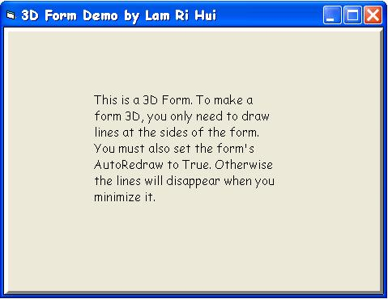



## Creating 3D Form Effect

### Description

Do you ever think about making a form with 3D appearance? If you are, then this code is what you are looking for. Leave comments + vote (if you think this is helpful).
 
### More Info
 

             |
---                |---
**Submitted On**   |2003-10-08 20:28:20
**By**             |[Lam Ri Hui](https://github.com/Planet-Source-Code/PSCIndex/blob/master/ByAuthor/lam-ri-hui.md)
**Level**          |Beginner
**User Rating**    |5.0 (15 globes from 3 users)
**Compatibility**  |VB 4\.0 \(16\-bit\), VB 4\.0 \(32\-bit\), VB 5\.0, VB 6\.0
**Category**       |[Custom Controls/ Forms/  Menus](https://github.com/Planet-Source-Code/PSCIndex/blob/master/ByCategory/custom-controls-forms-menus__1-4.md)
**World**          |[Visual Basic](https://github.com/Planet-Source-Code/PSCIndex/blob/master/ByWorld/visual-basic.md)
**Archive File**   |[Creating\_31655701082003\.zip](https://github.com/Planet-Source-Code/lam-ri-hui-creating-3d-form-effect__1-49099/archive/master.zip)

